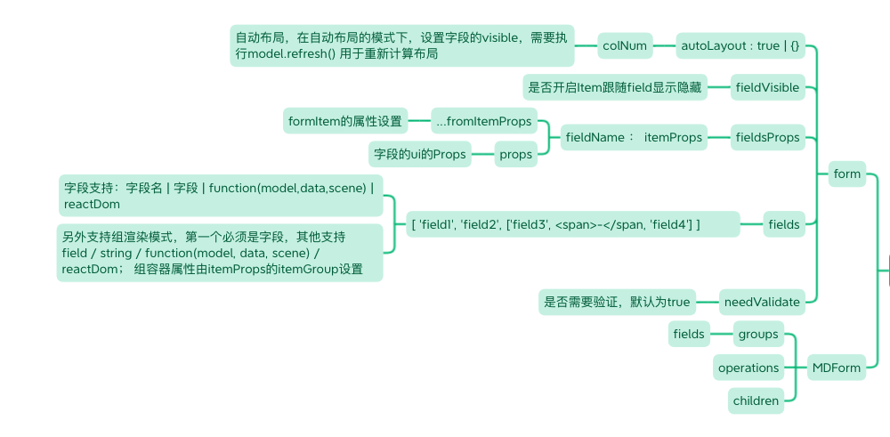

# MDForm

MDForm ： 在Form的基础上，加入了复杂布局和基本操作(基于Operations)的能力；数据对象模型的render方法会用此进行渲染；

Form一般情况没必要使用，全部使用MDForm来构建表单；MDForm继承了AntD Form几乎全部属性；
又两种使用方式，一种是模型渲染，一种是组件渲染

- 模型渲染，在数据对象模型直接render就可以实现form的渲染，推荐方式
- 组件渲染，标准的ReactDom的渲染方式，参数和能力和模型渲染一致，但需要接受模型;另外，支持子Dom, 可以实现更复杂的自定布局(模型渲染渲染中对应的是children参数)

```javascript
import  { MDForm,Form } from 'md-antd';
import DemoModel from './model';

const Demo = () => {
  // 必须为数据对象模型
  const mDemo = DemoModel.use();

  const formProps = {
    labelCol: { span: 8 },
    labelAlign: 'right',
    // 渲染场景，edit | view
    scene: 'edit',
    // form中药显示的字段
    fields: ['name', 'age','extendProps'],
    // formItem的布局
    itemLayout: {
      colNum:2
     },
    // 使用自定义分组布局，详细后面布局部分
    // groups:[],
    // fieldset设置，详细见fieldset详细文档
    fieldset: {
      extendProps: {
        // itemLayout下所占列数
        colSpan: 2,
        // 渲染场景,
        scene: 'view',
         // 针对表单的item的属性设置
        itemProps:{},
        // 字段渲染组件的props
        props: {},
        // itemGroup的属性配置，itemGroup模型下有效，主要控制包裹的div
        itemGroup: {},
        // 自定义渲染
        render(props, data,scene) {}
      },
    },
    // 操作设置, 完善属性见 Operations
    operations: {
      // 操作按钮的对齐方式 left | center | right
      align: 'right',
      // 操作项
      items: [
        {
          // 操作明，from内置 save和reset
          name: 'save',
          type: 'primary',
          title: '保存字段',
          // 点击事件,内置行为有默认操作
          onClick(e,{model, scene}) {}
        },
        // 使用reset，不做任何改动
        'reset',
        {
          name: 'delete',
          title: '删除',
          // 确定弹窗配置，支持{}做属性配置，见Antd Confirm
          confirm: '确定删除该字段？',
          onClick: e => {
            mItemModel.deleteItem({ autoFill: true });
            mItemModel.setOriginData(mItemModel.getStore());
          },
        },
      ],
    },
  };
  // 模型渲染
  return mDemo.render(formProps);
  // 组件渲染
  return <MDForm model={mDemo} {...formProps}>
      <Form.Item fields={['name','age']} fieldset={}></Form.Item>
      <Form.Item fields={['extendProps']} fieldset={}></Form.Item>
  </MDForm>
}

```

## 布局

布局是MDForm的特有属性，主要有三种方式进行配合使用；

- itemLayout，设定最基础的字段项的布局和排列方式
- groups, 分组布局
- itemGroup，控制字段内的排布，可以多字段，已经dom混合排布

### itemLayout

有两种布局方式：

- grid 网格布局
  默认布局，可以设置列数，开启后自动根据列数进行行列计算生成grid布局；
  宽度按列数进行等分；
  itemLayout中item的labelCol.span也会自动计算；
  
- fluid 流式布局
  根据固定宽度进行依次排布;
  

```javascript
// grid布局
{
    // 完整设置
    itemLayout: {
      // 列数
      colNum: 2,
      // 采用的AntD的Col和Row，这里可以设置其属性
      props: {
        row: {
          gutter: 8,
        },
        col: {}
      },
    },
}
// fluid布局
{
    // 完整设置
    itemLayout: {
      // 设定统一的item宽度，也可以在每个item中单独设置各自宽度
      width: '300px'
    },
}


```

### groups

分组布局，可以手动设置布局方式和组件，更为灵活，支持多层嵌套和自自定义渲染

```javascript
{
  // 设置了groups，就不用再设置fields了
  groups: [
      {
        // 渲染类型为tab，可以自定义
        renderType: 'tab',
        items: [
          {
            // 如果设置title则会渲染分割
            title: '基本配置',
            items: [
              {
                // 在fields下面的字段，会根据autoLayout的配置进行排布
                fields: [
                  'name',
                  'title',
                  'configType',
                  'itemType',
                  'format',
                  'decimal',
                  'source',
                  'structure',
                  // itemGroup，在一个item中扩展多个渲染，必须包含一个字段
                  ['min', <span key="1">-</span>, 'max'],
                  'required',
                ],
              },
              // 完整占用一行
              {
                fields: ['desc'],
              },
              {
                title: '类型特有配置',
                fields: ['extendProps'],
                // 支持判断是否显示
                checkVisible(model) {
                  return model.extendProps.structure != null;
                },
                // 设定item的布局
                itemLayout: {}
              },
            ],
          },
        ],
      },
    ],
    // 字段的props设置
    fieldset: {
      // itemGroup的属性设置在fieldset中
      min: {
        // 该字段在itemLayout中占据的列数
        colSpan: 2,
        // 针对表单的item的属性设置
        itemProps:{},
        // itemGroup的属性配置，主要控制包裹的div
        itemGroup: {
          style: {
            display: 'flex',
            alignItems: 'center',
            justifyContent: 'flex-start',
          },
        },
      },
    },
}
```

### 自定义

通过组件渲染的方式可以自定义想要的布局

```javascript
import  { MDForm,Form } from 'md-antd';

const Demo = () => {
  return <MDForm>
    <div>
      <Form.Item fields={[]} fieldset={}></Form.Item>
    </div>
  </MDForm>
}
```

## 完整属性


