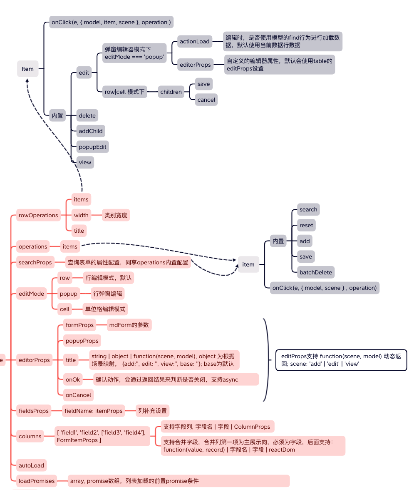

## MDTable

Table: 由antd的Table扩展而来，实现和模型的绑定；
MDTable: 在Table的基础上，加入了完整CRUD的能力；以及多种编辑模式；数据列表模型的render方法会用此进行渲染

通常情况使用MDTable即可；如果只是使用 Antd Table的功能，可以考虑Table

```javascript
import  {Table，MDTable } from 'md-antd';

const Demo = () => {

const tableOptions = {
    // 自动加载，开启后，会自动执行模型的query并进行数据绑定
    autoLoad: true,
    // 开启过滤，生产查询表单
    filter: true,
    // 编辑模式，popup代表使用弹窗进行编辑，另外还有row：行操作编辑和cell: 单元格编辑
    editMode: 'popup',
    // 列表项，除了field外，其他项都为Antd Table的column的设置
    columns: [
      { field: 'shopName', width: '20%' },
      { field: 'shopId', width: '10%' },
      { field: 'mail', width: '20%' },
      { field: 'status', width: '10%' },
      { field: 'updatedTime', width: '20%' },
      { field: 'updatedBy', width: '10%' },
    ],
    // 行操作, 内置了edit，view和delete行为逻辑
    rowOperations: {
      items: [
        {
          name: 'edit',
          title: '绑定',
          // 判断是否显示
          checkVisible({ item }) {
            return item.bindStatus !== 1;
          },
          // 行为事件，定义了会覆盖内置的逻辑
          // onClick(e, args) {
          //   const {item, model, scene} = args;
          // }
        },
        {
          name: 'delete',
          title: '解绑',
          // confirm设置
          confirm: {
            title: '您即将解绑邮箱，请确认?',
          },
          // 执行成功后的消息
          message: '解绑成功',
          checkVisible({ item }) {
            return item.bindStatus === 1;
          }
        },
      ],
    },
    // 弹窗编辑器属性
    editorProps: {
      title: '绑定邮箱',
      width: 600,
      // 编辑器操作项
      operations: {
        // 内置了save和cancel
        items: [
          'cancel',
          {
            name: 'save',
            title: '绑定邮箱',
            message: '邮箱绑定成功'
          },
        ],
      },
      // form的属性，对应MDForm当属性设置
      formProps: {
        // 表单展示的字段
        fields: ['shopName', 'shopId', 'mail', 'password'],
        // 字段的ui属性设置
        fieldsProps: {
          shopName: {
            scene: 'view',
          },
          shopId: {
            scene: 'view',
          },
        },
      },
    },
    // 查询表单属性，mdForm的属性设置
    searchProps: {
      operations: {
        items: [
          {
            name: 'search',
          },
        ],
      },
    },
  }；

  return <MDTable {...tableOptions}></MDTable>
}
```

## 完整参数


