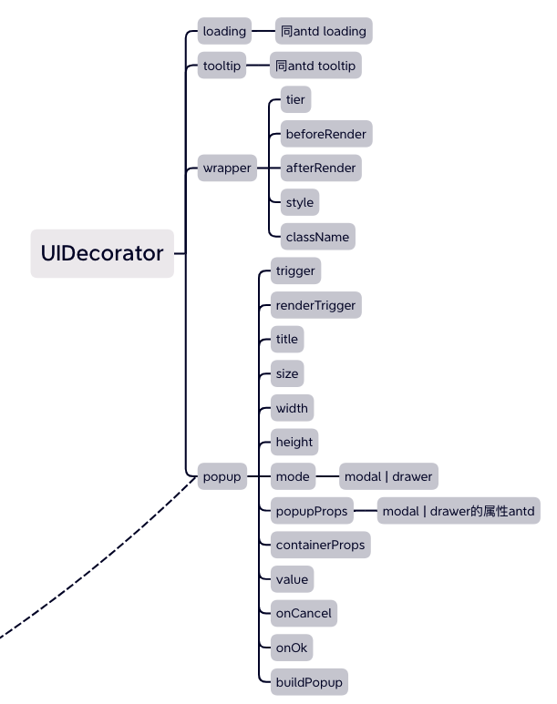

# UIDecorator

UI装饰器，是可以在当前UI上实现一些UI装饰的动作；

## 装饰器使用

目前主要使用在Field的渲染上；通过Field定义uiDecorator（初始）或者field.setUIDecorator（动态变更）来使用；

```javascript
// 字段定义
const fieldOptions = {
  // 字段其他属性
  ...,
  // uiDecorator设置
  uiDecorator: {
    wrapper: {
      // 判断是否应用装饰器，默认应用
      isApply({field, scene, data}) {
        return scene === 'view';
      },
      //wrapper的属性
      renderBefore({field, scene, data}) {
        // 返回react dom
        return '$';
      },
    }
  }
};
// 字段实例化后,可以通过setUIDecorator动态改变，会触发字段的重新渲染
field.setUIDecorator(
  wrapper: {
      //wrapper的属性
      renderBefore() {
        return '¥';
      },
    }
)
```

## 内置装饰器



## 装饰器的开发和注册

装饰器其实也是一个组件，只是约定了必须结构children的属性；另外会在属性中传递 `{field, scene, data}`属性

比如：内置的loading和tooltip都是通过antd的组件直接注册使用

```javascript
// 可以通过Configuration扩展UI装饰器,
import {Spin} form 'antd';

Configuration.set('UIDecorator', {
  loading: {
    // 直接使用组件对象
    component: Spin,
    props: {},
  },
  tooltip: {
    // 通过组件名匹配UIStore中的组件，可以通过UIService.addUI(Tooltip, 'Tooltip')注册；
    component: 'Tooltip',
    props: {},
  },
});
```
