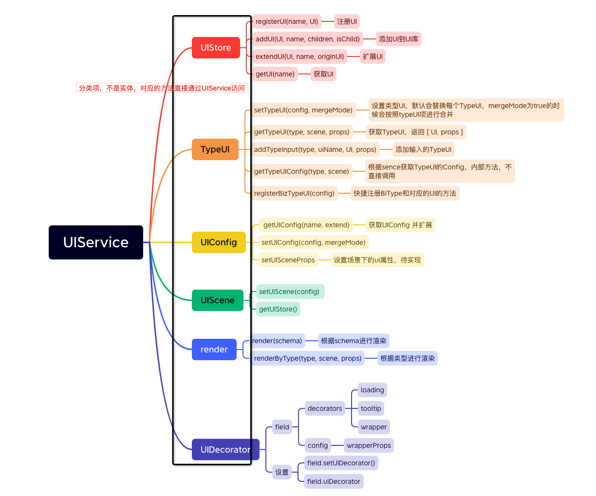
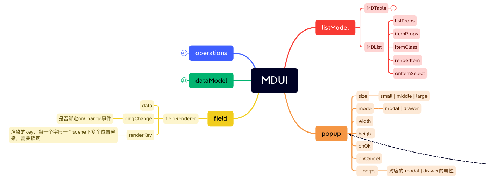

# MD-AntD
MD-Antd是将Antd接入md-base-ui协议，实现模型和UI的结合的一套UI库；内部实现了TypeUI，字段&模型渲染，模型&字段的UI绑定、渲染等能力；能够方便的通过模型来实现各种UI效果；

`注意目前支持Antd的版本是4.24.x`

## UIService说明
```javascript
import UIService, {FieldRenderer, Form，MDForm, Table，MDTable, MDList, Popup, Operations } from 'md-antd';

```
UIService，UI服务对象，控制UI库的基座，所有对象的操作都挂载在UIService上；
### 核心对象说明
* UIStore ： UI组件库的存储，可以通过`UIService.addUI`添加；通过`UIService.getUI`获取；
* UIConfig ：针对UIStore的组件进行默认配置，以及和field的属性关联设置；
* TypeUI ：数据类型对应的渲染组件，匹配字段的`dataType`和`bizType`，每个类型都有对应的渲染组件，还可以针对不同场景，不用展示进行设置；[详细文档](./TypeUI.md)
* UIScene ：ui渲染场景，内置组件的基本属性，会影响最后的渲染，最基础的为`view`和`edit`，另外针对不同组件或者场景可以自行扩展
* UIDecorator ：UI装饰器，目前主要应用在字段的渲染上，进行装饰。[详细文档](./decorator.md)等



## 内置组件说明
组件名称 | 对象类型 | 说明
:--------------- | :-: | :-
FieldRenderer | 渲染器 |  实现field的渲染，字段的render方法会生成（推荐），可以直接当组件使用；
Form | 组件 |  由antd的Form扩展而来，实现和模型的绑定；
MDForm | 组件 |  在Form的基础上，加入了复杂布局和基本操作(基于Operations)的能力；数据对象模型的render方法会用此进行渲染，[详细文档](./MDForm.md.md)
Table | 组件 |  由antd的Table扩展而来，实现和模型的绑定；
MDTable | 组件 |  在Table的基础上，加入了完整CRUD的能力；以及多种编辑模式；数据列表模型的render方法会用此进行渲染，[详细文档](./MFTable.md)
MDList | 组件 | 数据列表模型的简化渲染list组件，不带任何内置功能；
Popup | 组件 | 弹窗组件，集成了antd的modal和drawer，通过type来区分；内置了基础的操作
Operations | 组件 | 操作组件，会渲染一组操作按钮（支持各种类型的button），支持预设行为，confirm消息提示，执行成功提示等功能,[详细文档](./Operation.md)


其他组件属性图




