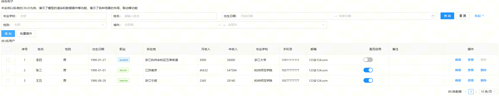
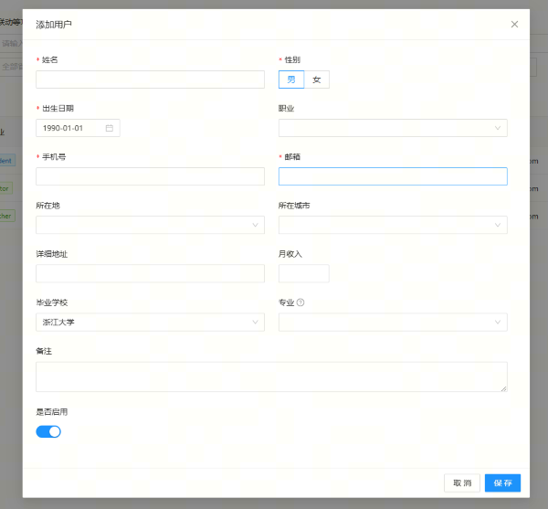

# 常用功能

看过了入门的例子后，这里我们将一些常用的实现聚合到一起输出一个demo, 一起进行讲解；关于一些框架的思想和原理可以参考[介绍部分](../introduce/index.md)

## 模型使用

### 模型定义

模型主要分为数据对象模型和数据列表模型，创建的方式一样，用`modelType`来区分，默认是数据对象模型。
首选从通过`MD.create`创建一个元模型，定义出结构(字段)和action。详细参数见[模型参数](../api/model-options.md);
然后通过元模型扩展具体的场景模型（当然如果比较简单的场景，一个元模型就可以了）关于模型的区分可以见[模型介绍](../introduce//model.md)

```javascript
import MD from 'md-base';
// 基础元模型
const BaseUserModel = MD.create({
  name: 'BaseUserModel',
  title: '基础用户模型',
  // 字段定义
  fields: [
    {
      name: 'name',
      title: '姓名',
      dataType: 'string',
      required: true,
      max: 10,
    },
  ],
  // 数据行为配置
  action: {},
  // 自定义的扩展属性
  props: {},
});

// 扩展的模型可以继承元模型的特性
const UserListModel = BaseUserModel.extend({
  name: 'UserListModel',
  title: '用户列表模型',
  modelType: 'List',
  // 字段的扩展有两个模型，设置数组是重新定义字段（字段数量=数组数量），设置对象则是扩展原有模型，如果不存在的也会新增（字段数量=元模型字段数+新增字段数）
  fields: ['name'],
  // 扩展模式
  // fields: {
  //   name:{}
  // }
});
```

### Action

数据交互行为（即数据请求），内置了常用的 query，insert，update，delete， find(查找单个)的行为，默认渲染会和渲染组件绑定, 实现预设的逻辑操作。详细的配置见[模型构建参数-Action](../api/model-options.md)

```javascript
{
   // 行为配置（数据请求行为），内置了基于模型的query，update，insert，delete, find五个action，还可以定义其他的
  action: {
    // 查询配置，查询的参数来源于filter，一般不用设置fields
    query: {
      // 地址
      url: "/user/get",
      // 查询项配置，除了data外，其他配置项由设置的请求引擎来决定
      options: {
        // 请求类型
        type: "get",
        // 查询默认参数
        data: {
          tenantId: 1,
          platformType: 2,
        },
      },
    },
    update: {
      url: "/user/update",
      // update的字段
      fields: ["shopId", "mail", "password", "tenantId", "platform"],
    },
    // 删除默认会通过模型设置的key字段作为参数
    delete: {
      url: "/user/delete",
    },
    // mock配置，需全局设置设置了mockEngine和开启mock
    mock:{
      // 是否启用
      enable:true
    }
  },
}
```

### 模型渲染

使用`model.render(props,scene)`渲染，根据模型类型来使用Form或Table的渲染，会将模型能力和组件进行结合，完成一些预设的逻辑，同时提供了常用的布局方案，以及细节的扩展，详细见[UIApi](../antd/index.md)

## 字段使用

字段是模型的核心，普通字段的定义比较简单,如上诉例子中，`name,title,dataType`就能完成一个字端的定义，更细的见[字段文档](../api/field.md)
此外，还有一个特殊的属性`key`, 通常和`name`是一致的，但有时数据提供的名和字段名不一致这里就需要用到`key`了.（这里涉及到了一个模型稳定态的设计思路见[模型字段设计](../introduce/model.md)）

### 数据类型&验证

字段的核心则是数据类型，数据类型会影响到数据转换，渲染等各方面能力。内置的数据类型见[数据类型文档](../api/type.md)，对应渲染的UI见[TypeUI文档](../ant/typeui.md)，文档都有详细说明如何定义字段数据类型和对应的渲染组件

同时可以方便定义扩展类型和业务类型来快速沉淀。相关属性如下

```javascript
{
  dataType: 'string',
   // 是否开启验证
  isValid: true,
  // 是否必须
  required: true,
  // 最大值，不同类型的最大，最小值的含义不一样，string/array代表长度，number/date代表数值，
  max: 20,
  // 最小值, 同上
  min: 0,
  // 自定义规则，正则或者正则字符
  regular: '',
  // 自定义验证方法，要求返回 {success: true, message: ''}
  valid(value, data){},
  //自定义验证信息，统一的验证信息通过Configuration来定义，特殊的可以自定义, 规则如下：
  validationMessage: {
    required: '【${field.title}】不能为空！',
    min: '【${field.title}】不能大于【${ruleValue}】个字符！'
  },
}
```

### 类型扩展

针对一些公共的字段类型，我们可以抽象出来变成类型，可以将逻辑，展示等都进行沉淀。如例子中，将设置`dataType为phone和email`, 这两个类型不在模型驱动内置类型中，而是通过扩展类型来实现的。

```javascript
[
  {
    name: 'phone',
    title: '手机号',
    // 使用phone的扩展类型，类型定义见common/type.js
    dataType: 'phone',
    required: true,
    max: 11,
  },
  {
    name: 'email',
    title: '邮箱',
    // 使用email的扩展类型
    dataType: 'email',
    required: true,
  },
];
```

实现代码如下，这里是定义的扩展类型，里面简单的设定了一些校验规则；另外，还可以设定业务类型，如何区分和定义详细见[类型文档](../api/type.md); 同样还可以为对应的类型设置渲染的TypeUI，详细见[TypeUI文档](../api/typeui.md)，更加高级的用法见[进阶章节](./advance.md)

`善用类型扩展,管理好类型沉淀，可以让开发变的更加简单`

```javascript
// 注册扩展类型
MD.registerExtendType({
  email: {
    // 基础数据类型
    baseType: 'string',
    // 字段属性的扩展
    fieldProps: {
      // 校验规则
      regular:
        '^\\s*\\w+(?:\\.{0,1}[\\w-]+)*@[a-zA-Z0-9]+(?:[-.][a-zA-Z0-9]+)*\\.[a-zA-Z]+\\s*$',
      // 错误提示
      validationMessage: {
        regular: '请输入正确的邮箱地址!',
      },
    },
  },
  phone: {
    baseType: 'string',
    fieldProps: {
      regular: '^1[3456789]\\d{9}$',
      validationMessage: {
        regular: '请输入正确的手机号码!',
      },
    },
  },
});
```

### 枚举数据源

当`bizType='enum'`设置成枚举类型时，就需要定义枚举数据源`source`，支持异步，能够满足大部分的需求，但如果有些枚举需要通用化以及还有一些逻辑处理的，可以使用DataEnum来独立实现。
例子中实现了三种枚举的定义：

1. 静态枚举：直接通过静态数据定义。
2. 异步枚举：通过异步的方式获取数据。
3. DataEnum：通过构建独立的对象，来实现负责的逻辑和交互

除此之外，还支持模型，字段等关联数据源模式，详细见[枚举数据源文档](../api/field.md#枚举数据源)

`注意，枚举数据源的沉淀推荐是作为业务字段进行扩展，而不是直接使用数据源`

```javascript
[
  {
    // 静态枚举
    source: [
      {
        value: 1,
        label: '男',
      },
      {
        value: 0,
        label: '女',
      },
    ],
  },
  {
    // 开启加载监控，会等source加载完成，才会渲染table
    loadPromise: true,
    // 简单远程数据可以直接使用异步的source
    async source() {
      // 模拟异步返回
      return new Promise((resolve) => {
        setTimeout(() => {
          resolve([
            {
              code: 'student',
              name: '学生',
            },
            {
              code: 'doctor',
              name: '医生',
            },
          ]);
        }, 200);
      });
    },
    sourceConfig: {
      // 指定对应的key
      labelKey: 'name',
      valueKey: 'code',
    },
  },
  {
    // 公共的远程，建议使用DataEnum对象来管理，可以对列表的字段进行格式化
    sourceConfig: {
      dataEnum: SchoolEnum,
    },
    // 想要在列表中用source进行格式，需开启
    loadPromise: true,
  },
];
```

例子中定义了`SchoolEnum`的枚举对象，本质上也是个模型，只是字段内置了枚举的lable和value，代码如下, DataEnum的好处是能够在上面扩展，能够实现很多个性化的逻辑。

```javascript
import MD from 'md-base';

const SchoolEnum = MD.createDataEnum({
  name: 'SchoolEnum',
  title: '学校枚举',
  autoLoad: true,
  // label字段对应的key
  labelKey: 'title',
  // value字段对应的key
  valueKey: 'code',
  // 扩展属性
  action: {
    query: {
      url: '/getSchools',
    },
    mock: {
      enable: true,
      // 模拟远程加载
      query: {
        delay: 1000,
        response() {
          return [
            {
              code: 'zheda',
              title: '浙江大学',
            },
            {
              code: 'hangshi',
              title: '杭州师范学院',
            },
          ];
        },
      },
    },
  },
});
```

### 联动

联动是比较常用的功能，在模型驱动下，是通过字段类实现关联，然后通过触发字段的变化来实现联动。例子中是通过DataEnum的dataEnumLinks来实现的，这个是内置到了模型中，其实也是通过以下模式完成的实现；

```javascript
{
  // 字段联动设置, 支持单个{},多个[]，详细见后续联动配置说明
  links: {
    // 联动字段
    fields: ['type'],
    // 触发模式，有模型整体数据`dataChange`和字段值`valueChange`两种变更；加上both，可以实现精准控制
    triggerModel: 'valueChange',
    // 变动响应事件，上下文this=当前字段，通过this.model可以获取模型对象
    onChange(type, data,) {
      // 设置是否可见
      this.setVisible(type === 'link');
      // 更新字段属性,不仅更新自己，也可以更新其他的字段
      this.model.name.update({});
      // 返回值会更新当前字段的值；
      return '';
    },
  },
  // 关联字段，关联后两边的值会同步
  bindField: MDField,
  // 如果时模型字段，开启后，子模型变动会触发字段的值更新
  modelBinding:true,
}
```

### 值处理方法

字段有四个常用的方法，基础的处理已经内置，根据具体情况可以方便重载

```javascript
const field = {
  ...,
  // 获取字段值，data：为传入的数据，在数据中获取当前字段的值。数据模型中，不设置，会模型中取；而列表模型则必须设置；
  getValue(data) {},
  // 设置字段值，data：为目标对象，数据模型中，没有设置则会设置到模型上。而列表模型则必须设置；
  setValue(value,data) {}
  // 转换值，将传入的转成字段类型匹配的数据值，
  convertValue(value,data) {},
  // 将值格式化为字符串，在view场景展示下会调用，内部只会默认的转换成字符串输出，很多时候重载可以重现实现各种展示效果；
  formatValue(value,data) {}
};
```

### 字段渲染

字段可以通过`field.render(props,scene,data)`进行渲染， 通常不会直接使用，都是结合模型进行渲染，会有比较丰富的渲染方式和控制，只有碰到一些特殊布局的场景才需要手动进行渲染。

除了类型控制渲染外，还有以下其他属性可以影响渲染；

```javascript
{
  // 控制显示
  visible: false,
  // 控制只读，
  readonly:true,
  // 自定义ui配置
  uiConfig: {
    // 渲染组件
    component:'',
    // 组件属性
    props:{}
  },
  // 渲染状态，设置后会应用renders里面的配置生成渲染字段
  renderState: 'state1',
  // 渲染字段配置
  renders: {
    state1：{}
  },
  // 装饰器，相关使用见 UIApi中的UIDecorator部分
  uiDecorator: {},
  // 展示器，控制view场景渲染的效果，详细见UIApi中的Viewer部分
  viewer: {
    name:'',
    props:{}
  }
}
```

### dataAction

字段的dataAction是和模型的action配合使用的，模型的action会通过字段进行组织参数，一些场景请求参数名或者类型和模型的字段并不一致，这里就需要针对dataAction单独进行配置。后面例子中，字段birthday是date日期类型，在查询中是使用dataRange日期范围类型

```javascript
{
  // 数据字段的key，一般名称不同的情况，使用key就足够
  key:'',
  // 针对单个行为的设置，推荐放到具体的action的字段配置中，这样作用域更清晰
  dataAction: {
    // action参数对应的数据类型
    dataType:'',
    // 参数名
    key:'',
    // 自定义转换方法，返回值会替换当前字段的值。也可以扩展请求参数data
    convert(value,data){}
  }
}
```

## 页面开发

下面以react为例，正常react开发，只是中间接入了模型进行渲染。

### 模型实例化

前面定义的模型都是元模型，只有实例化后，才能具体的消费。这时我们可以把当前页面展示的特性加入到模型上，将业务模型和展示模型做区分，避免单一场景来污染公共模型。

```javascript
import UserListModel from './models/user';

const MDDemo = () => {
  // 通过内置的hook实例化模型
  const mUserList = UserListModel.use(
    {
      // 模型扩展参数在这里设置，这里更多的加入一些页面展示的特性
    },
    (model) => {
      // 初始化方法，这里可以干预实例化后的模型
    },
  );

  // 渲染模型，这里list模型props对应是table的属性
  return mUserList.render(props);
};
```

## 例子代码

### 模型文件

```javascript
import MD from 'md-base';
// 引入枚举，具体代码和说明见下面枚举说明模块
import { SchoolEnum, MajorEnum } from './enum';

const BaseUserModel = MD.create({
  name: 'BaseUserModel',
  title: '基础用户模型',
  fields: [
    {
      name: 'id',
      title: 'ID',
      dataType: 'string',
      isKey: true,
      visible: false,
    },
    {
      name: 'name',
      title: '姓名',
      dataType: 'string',
      required: true,
      max: 10,
    },
    {
      name: 'sex',
      title: '性别',
      dataType: 'number',
      bizType: 'enum',
      required: true,
      source: [
        {
          value: 1,
          label: '男',
        },
        {
          value: 0,
          label: '女',
        },
      ],
      defaultValue: 1,
    },
    {
      name: 'birthday',
      title: '出生日期',
      dataType: 'date',
      required: true,
      // 默认值一般定义成字段对应的数据类型，但其他类型也会进行转换
      defaultValue: '1990-01-01',
    },
    {
      name: 'job',
      title: '职业',
      dataType: 'string',
      bizType: 'enum',
      // 开启加载监控，会等source加载完成，才会渲染table
      loadPromise: true,
      // 简单远程数据可以直接使用异步的source
      async source() {
        // 模拟异步返回
        return new Promise((resolve) => {
          setTimeout(() => {
            resolve([
              {
                code: 'student',
                name: '学生',
              },
              {
                code: 'doctor',
                name: '医生',
              },
              {
                code: 'teacher',
                name: '老师',
              },
              {
                code: 'engineer',
                name: '工程师',
              },
            ]);
          }, 200);
        });
      },
      sourceConfig: {
        // 指定对应的key
        labelKey: 'name',
        valueKey: 'code',
      },
    },
    {
      name: 'phone',
      title: '手机号',
      // 使用phone的扩展类型，类型定义见下面的扩展类型部分
      dataType: 'phone',
      required: true,
      max: 11,
    },
    {
      name: 'email',
      title: '邮箱',
      // 使用email的扩展类型
      dataType: 'email',
      required: true,
    },
    {
      name: 'province',
      title: '所在地',
      dataType: 'string',
      bizType: 'enum',
      // 这里定义的子结构，city可以设置联动获取
      source: [
        {
          value: 'zhejiang',
          label: '浙江',
          children: [
            {
              value: 'hangzhou',
              label: '杭州',
            },
            {
              value: 'ningbo',
              label: '宁波',
            },
          ],
        },
        {
          value: 'jiangsu',
          label: '江苏',
          children: [
            {
              value: 'nanjing',
              label: '南京',
            },
          ],
        },
      ],
    },
    {
      name: 'city',
      title: '所在城市',
      dataType: 'string',
      bizType: 'enum',
      // source配置，关联省字段的子数据
      sourceConfig: {
        //设置父字段
        parentField: 'province',
        // 设置对应的子项的key
        childrenKey: 'children',
      },
    },
    {
      name: 'address',
      title: '详细地址',
      dataType: 'string',
    },
    {
      name: 'salary',
      title: '月收入',
      dataType: 'number',
    },
    {
      name: 'school',
      title: '毕业学校',
      dataType: 'string',
      bizType: 'enum',
      // 公共的远程数据元，建议使用DataEnum对象来管理，可以对列表的字段进行格式化
      sourceConfig: {
        dataEnum: SchoolEnum,
      },
      // 想要在列表中用source进行格式，需开启
      loadPromise: true,
      defaultValue: 'zheda',
    },
    {
      name: 'major',
      title: '专业',
      dataType: 'string',
      desc: '学校联动',
      bizType: 'enum',
      sourceConfig: {
        dataEnum: MajorEnum,
        // dataEnum联动的配置，关联学校和专业，注意联动的数据暂时不支持在列表中进行格式化
        dataEnumLinks: [{ field: 'school', filterField: 'school' }],
      },
    },
    {
      name: 'remark',
      title: '备注',
      dataType: 'text',
    },
    {
      name: 'enabled',
      title: '是否启用',
      dataType: 'boolean',
      defaultValue: true,
    },
  ],
});

const UserListModel = BaseUserModel.extend({
  name: 'UserListModel',
  title: '用户列表模型',
  modelType: 'list',
  filter: {
    fields: [
      // 将学校设定成多选
      {
        name: 'school',
        dataType: 'array',
      },
      // 不做变化则直接使用字段字符
      'name',
      // 在查询中将生日设定成日期范围类型
      {
        name: 'birthday',
        dataType: 'dateRange',
        // 数据行为配置
        dataAction: {
          // 参数转换，将range转成两个字段，另外也可以建两个字段来获取范围值
          convert(range, data) {
            if (range) {
              const [startDate, endDate] = range;
              data.startDate = startDate;
              data.endDate = endDate;
            }
            // 返回值空则会清除原有字段
            return;
          },
        },
      },
      {
        name: 'sex',
        // 在查询中去掉默认值
        defaultValue: null,
        required: false,
        placeholder: '全部',
      },
      'province',
      // 使用string来创建字段会默认清除联动等的私有属性，这里直接使用字段会保留所有特性
      BaseUserModel.city,
    ],
  },
  // 定义数据行为，使用mock来模拟数据请求，后续可以通过
  action: {
    insert: {
      url: 'insert',
    },
    update: {
      url: 'update',
    },
    delete: {
      url: 'delete',
    },
    query: {
      url: 'queryUser',
    },
    find: {
      url: 'find',
    },
    // 可以在这里直接定义mock，为了好维护可以在下面进行了扩展
    // mock: {
    //   enable: true,
    //   // mock存储的表名
    //   store: "Users",
    // },
  },
});

// 设置mock，建议单独的mock.js来处理，在工程时，开启mock在加载
UserListModel.extendAction({
  mock: {
    enable: true,
    // mock存储的表名
    store: 'Users',
    // 字段干预配置，作用于insert和update，不限于模型字段
    fields: {},
    query: {
      // 延迟时间
      delay: 100,
      fields: {
        startDate: {
          compare(value, data) {
            return UserListModel.birthday.getValue(data, true) >= value;
          },
        },
        endDate: {
          compare(value, data) {
            return UserListModel.birthday.getValue(data, true) <= value;
          },
        },
      },
    },
  },
});

export default UserListModel;
```

### 页面代码

```javascript
import React, { useEffect, useState } from 'react';
import UserListModel from './models/user';

const MDDemo = () => {
  const mUserList = UserListModel.use(
    {
      fields: {
        yearIncome: {
          dataType: 'number',
          title: '年收入',
          // 是否内部存储，一些展示所用的字段，不通用存储下来，可以设置此属性
          isStore: false,
          // 私有字段，默认不会继承
          private: true,
          // 自定义渲染，这里计算年度收入
          formatValue(value, data) {
            const salary = this.model.salary.getValue(data);
            if (salary != null) {
              return salary * 12;
            }
          },
        },
      },
    },
    (model) => {
      // 监听list模型updateItem事件，行数据力度, 可以通过updateItem和oldItem数据变化判断字段变化，字段级的监控要到，字段的links中；
      model.onUpdateItem('updateEnabled', (res, updateItem, oldItem) => {
        // 判断enabled是否变化
        if (
          model.enabled.getValue(updateItem) != model.enabled.getValue(oldItem)
        ) {
          // 获取更新需要的字段
          const data = model.getFieldsValue(
            ['id', 'name', 'enabled'],
            updateItem,
          );
          model.setLoadingStatus(true);
          // 调用保存方法
          model.save(data).then(() => {
            alert(`${data.name} 的状态已改变为 ${data.enabled}`);
            // model.setLoadingStatus(false);
          });
        }
      });
    },
  );

  const searchProps = {
    // search默认会关闭验证，这里可以手动开启
    // needValidate:true,
    // 折叠展开
    collapse: true,
    //form item的布局，默认栅格布局
    itemLayout: {
      // 列数量
      colNum: 4,
    },
    fields: [
      'school',
      'name',
      'birthday',
      'sex',
      // itemGroup模式
      ['province', <span key={0}>--</span>, 'city'],
    ],
    // 通过fieldset去干预查询字段的显示
    fieldset: {
      birthday: {
        // 设置占据两列
        colSpan: 2,
      },
      province: {
        colSpan: 2,
        itemProps: {
          label: '城市',
        },
        props: {
          placeholder: '全部省',
        },
      },
      city: {
        props: {
          placeholder: '全部市',
        },
      },
    },
  };

  const editFormProps = {
    // 字段项的布局配置
    itemLayout: {
      colNum: 2,
    },
    fieldset: {
      sex: {
        props: {
          // 设置横排模式，具体的在typeUI中定义
          uiMode: 'hor',
        },
      },
      remark: {
        colSpan: 2,
      },
    },
    layout: 'vertical',
  };

  return (
    <div>
      <h1>综合例子</h1>
      {
        // 使用模型渲染方法，这里是列表模型所以对应的渲染是MDTable，详细属性见MDTable的文档
        mUserList.render({
          // 自动加载，开启后，会自动执行模型的query并进行数据绑定
          autoLoad: true,
          // 设置为编辑场景
          scene: 'edit',
          // 显示序号
          showSeq: true,
          // 查询配置
          searchProps,
          // 开启过滤，生产查询表单
          filter: true,
          // 列设置，除了field和scene 外，其他配置和antd column一致
          columns: [
            { field: 'name', width: 100 },
            { field: 'sex', width: 100 },
            { field: 'birthday', width: 100 },
            { field: 'job', width: 100 },
            { field: ['province', 'city', 'address'], width: 200 },
            { field: 'salary', width: 100 },
            { field: 'yearIncome', width: 100 },
            { field: 'school', width: 100 },
            { field: 'phone', width: 100 },
            { field: 'email', width: 200 },
            { field: 'enabled', scene: 'edit', align: 'center', width: 100 },
            { field: 'remark', width: 200 },
          ],
          // 干预列表的展示
          fieldset: {
            job: {
              // 设置展示器
              viewer: {
                // 使用tag类渲染job
                name: 'tag',
                props(value) {
                  return {
                    color: value === 'student' ? 'blue' : 'green',
                  };
                },
              },
            },
          },
          // 编辑器配置
          editorProps: {
            // 基础表单设置
            formProps: editFormProps,
            //查看场景扩展配置会合并formProps
            viewProps: {
              // 定义表单分组布局，
              groups: [
                {
                  // 第一层使用使用tab模式来分组
                  renderType: 'tab',
                  items: [
                    {
                      // 具体的tab项
                      title: '基础信息',
                      // tab下子级分组
                      items: [
                        {
                          // 使用默认的分组，默认分组为antd的divider
                          title: '基础',
                          fields: ['name', 'sex', 'birthday'],
                        },
                        {
                          title: '联系方式',
                          fields: ['phone', 'email'],
                        },
                      ],
                    },
                    {
                      title: '家庭地址',
                      items: [
                        {
                          // 使用itemGroup和组合省市字段
                          fields: [['province', 'city'], 'address'],
                        },
                      ],
                    },
                    {
                      title: '职业',
                      fields: ['job', 'salary'],
                    },
                    {
                      title: '其他',
                      fields: ['remark'],
                    },
                  ],
                },
              ],
            },
            // 编辑场景扩展配置会合并formProps
            editProps: {
              fieldset: {
                // 新增模式下name不可编辑
                name: {
                  scene: 'view',
                },
              },
            },
            // 新增场景扩展配置会合并formProps
            addProps: {},
          },
          // 开启行选择
          rowSelection: true,
          // 行行为配置
          rowOperations: {
            width: 200,
            fixed: 'right',
            // 默认使用edit和view行为，这些行为会自动的和模型的action进行结合
            items: [
              'edit',
              'view',
              {
                name: 'delete',
                // 扩展delete，动态设置按钮的属性
                props({ model, item }) {
                  return {
                    disabled: !model.enabled.getValue(item),
                  };
                },
              },
            ],
          },
          // 表单行为设置
          operations: {
            items: [
              'add',
              // 自定义一个操作
              {
                name: 'batch',
                title: '批量操作',
                onClick(e, { model }) {
                  alert(model.getSelectedKeys());
                },
              },
            ],
            // 渲染包装器，扩展操作区渲染，这里加入了显示总数的组件
            renderWrapper(operations) {
              return (
                <>
                  {operations}
                  <ExtendInf model={mUserList} />
                </>
              );
            },
          },
          scroll: {
            x: 800,
          },
        })
      }
    </div>
  );
};

// Model渲染内容较多，如果不是模型本身展示的变化可以单独抽象组件，这样setState就不会影响整体的刷新
const ExtendInf = (props) => {
  const { model } = props;
  const [totalUser, setTotalUser] = useState(0);

  useEffect(() => {
    // 注册模型的onRefresh事件，可以获取模型数据加载的变化
    model.onRefresh('changeTotal', () => {
      const pager = model.getPager();
      setTotalUser(pager.total);
    });
  }, []);

  return <div>共{totalUser}名用户</div>;
};

export default MDDemo;
```

### 效果图




