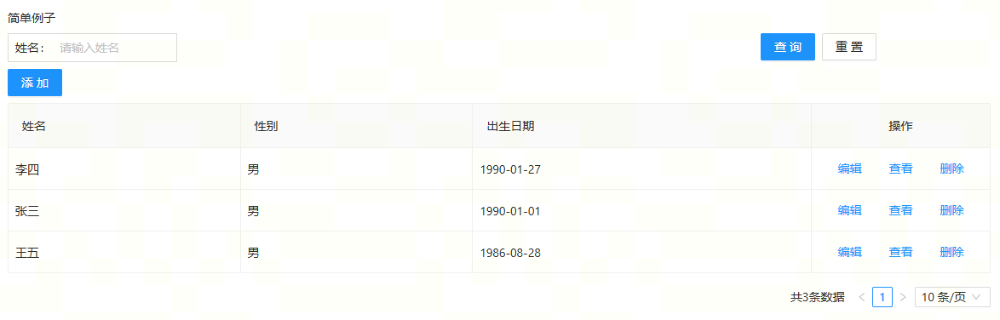

# 入门例子

我们用一个简单的例子来认识一下如进行开发；

1、定义一个模型
以一个用户模型为例子，我们首先建立一个`simple.js`文件（文件名建议使用模型名，这里是已经存在user模型，另外命名）,内容如下：

```javascript
import MD from 'md-base';

// 创建模型
const SimpleUserModel = MD.create({
  // 模型名称
  name: 'UserModel',
  // 模型显示名称，会在字段渲染中消费
  title: '用户模型',
  // 模型类型，list为列表模型
  modelType: 'List',
  // 字段定义
  fields: [
    {
      // 字段名称
      name: 'id',
      // 字段显示名，会在字段渲染中消费
      title: 'ID',
      // 数据类型
      dataType: 'string',
      // 是否主键
      isKey: true,
      // 是否可见，不可见则不会进行渲染
      visible: false,
    },
    {
      name: 'name',
      title: '姓名',
      dataType: 'string',
      // 是否必填
      required: true,
      // 最大长度
      max: 10,
    },
    {
      name: 'sex',
      title: '性别',
      required: true,
      dataType: 'number',
      // 业务类型，enum是枚举类型
      bizType: 'enum',
      // 枚举数据源
      source: [
        {
          value: 1,
          label: '男',
        },
        {
          value: 0,
          label: '女',
        },
      ],
      // 默认值
      defaultValue: 1,
    },
    {
      name: 'birthday',
      title: '出生日期',
      dataType: 'date',
      defaultValue: '1990-01-01',
    },
  ],
  // 过滤设置
  filter: {
    // 查询的字段
    fields: ['name'],
  },
  // 定义数据行为，即请求
  action: {
    insert: {
      url: 'insert',
    },
    update: {
      url: 'update',
    },
    delete: {
      url: 'delete',
    },
    query: {
      url: 'queryUser',
    },
    find: {
      url: 'find',
    },
    // mock设置，
    mock: {
      // 开启mock
      enable: true,
      // mock存储的表名
      store: 'Users',
    },
  },
});

export default SimpleUserModel;
```

2、添加一个页面

```javascript
import React from 'react';
import SimpleUserModel from './models/simple';
const Simple = () => {
  // 生成模型实例
  const mUserList = SimpleUserModel.use();

  return (
    <div>
      <h1>简单例子</h1>

      {mUserList.render({
        // 是否自动加载数据
        autoLoad: true,
        // 是否开启查询
        filter: true,
        // 设置为编辑场景
        scene: 'edit',
        // 行操作
        rowOperations: {
          items: ['edit', 'view', 'delete'],
        },
        // 列表操作
        operations: {
          items: ['add'],
        },
      })}
    </div>
  );
};
export default Simple;
```

最后效果如下，基础的curd功能都完成，接下来我们可以看一些稍微复杂的例子


