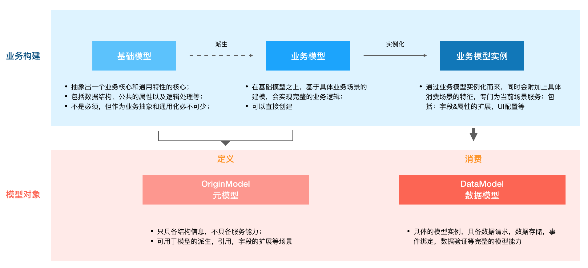

# 模型

## 模型的定义

- 模型的业务构建，是模型基于业务场景的抽象过程，进行业务模型的拆分；现实中不一定完全按照这个模式进行，一些简单场景可以直接构建业务模型

- 模型对象具体的载体，是具体开发中存在的对象；



以下是代码演化的工程，每个模型的建立都可以设定自己对应的特性，服务特定的场景，但最后溯源又都是基础模型

```javascript
// 定义一个商品的基础模型
const BaseGoodModel = MD.create({});

// 派生出一个生鲜商品，可以加入对应生鲜商品特性
const FreshGoodModel = BaseGoodModel.extend({});

// 派生一个营销场景模型，可以加入对应的营销特性
const MarketingGoodModel = BaseGoodModel.extend({});

// 在具体的页面上实例化，可以加入当前页面的展示特性
const mGoods = MarketingGoodModel.create();
```

## 模型渲染

模型本身是不具备渲染的能力的，而渲染能力是由UI库附加到模型上的。所有单纯的使用`md-base`库构建模型时无法渲染的，需要使用配套的UI库，目前基于antd4封装了`md-antd`。

- 模型渲染：根据模型类型Form和Table的渲染，基于ui组件融合了模型，同时加入了渲染的功能；
- 字段渲染：使用TypeUI进行渲染，内置了基础类型的渲染，可以随时扩展。或者引入一些公共的TypeUI；


渲染生成的结构图：


渲染效果图说明


## DataAction

数据交互行为（可以认为是数据请求），内置了常用的 query，insert，update，delete， find(查找单个)的行为，具有固定的数据结构，同时可以使用`DataMapping`数据映射进行出入转换.

另外，可以方便的使用`md-mock`进行数据模拟，能够满足数据的功能交互，保证在数据接口提供之前，实现完成的功能开发；
