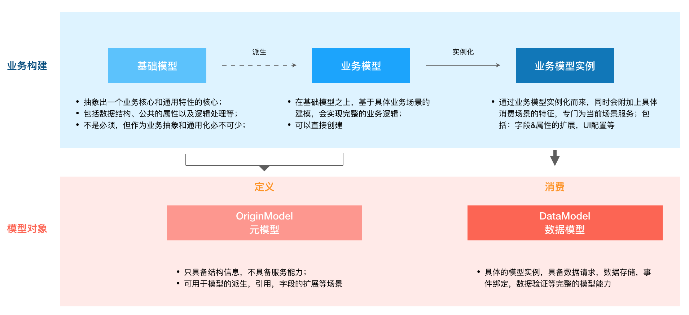

# 模型简介



## 模型定义
```js
import { MD } from "md-base";

const BaseModel = MD.create({
  name:'BaseModel',
  title: '基础模型',
  fields: [
    {
      name: "name",
      title: "名称",
      dataType: "string",
    },
    {
      name: "date",
      title: "日期字符",
      dataType: "date",
      format: "YYYY-MM-DD",
    },
    {
      name: "number",
      title: "数字",
      dataType: "number",
      decimal: 2,
      min: 100,
      max: 10000,
    },
    boolean: {
      name: "boolean",
      title: "布尔",
      dataType: "boolean",
    },
  ]
});

// 定义业务模型
const DataModel = BaseModel.extend({
  name: 'DataModel',
  title: '数业务模型',
  // fields可以为{}|[]，对象时，表示扩展原有字段；数组时：重新构建字段，name相同字段会继承父模型的字段
  fields: {
      name: {
        // 在name字段上加入联动功能
        links:{
          fields: ['number'],
          onChange(number) {
            return this.getValue() + number;
          }
        }
      },
      // 父模型中不存在此字段，则会新增
      sex: {
        title: '性别',
        dataType: 'integer',
        // 定义枚举
        bizType: 'enum',
        // 枚举数据源
        source: [{value: 0, label: '女'},{value: 1, label: '男'}]
      }
  },
  // 添加属性
  props: {
    addNumber() {
      this.number.setValue(this.number.getValue() + 1);
    }
  },
});

// 业务模型实例
const model = DataModel.create({
  name:'userModel',
  title: '用户模型',
  // 只使用name，sex两个字段，同时将name的title更改
  fields: [
    {
      name: 'name',
      title: '用户名',
    },
    'sex',
  ]
});
```


