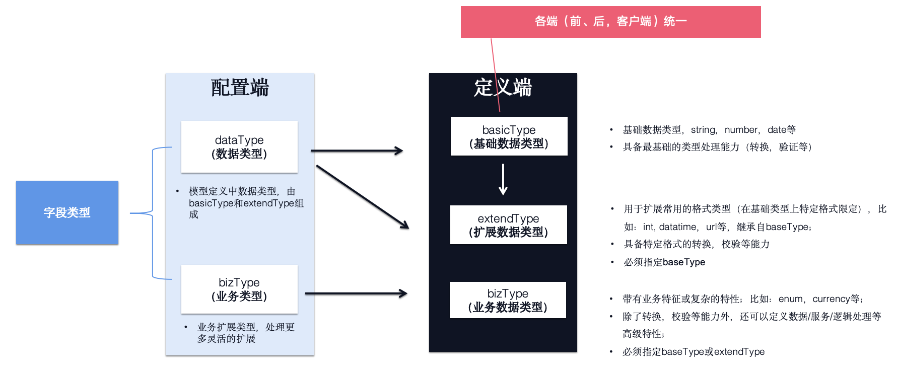

# 数据类型



## 内置数据类型说明

无论那种类型，都有下面两种转换方法

- `convertValue(value)`: 将其他类型转换成当前类型
- `formatValue(value)` : 将当前类型转换成字符串类型

| 类型名称  |  类型类别  | 说明                                                                                   |
| :-------: | :--------: | :------------------------------------------------------------------------------------- |
|    any    |  baseType  | 不确定的类型，特殊场景使用                                                             |
|  string   |  baseType  | 字符串类型                                                                             |
|   date    |  baseType  | 日期类型，默认配置 `format: "YYYY-MM-DD"`                                              |
|  boolean  |  baseType  | 布尔类型                                                                               |
|  number   |  baseType  | 数字串类型                                                                             |
|   array   |  baseType  | 数组串类型，默认配置 `format: "{0},{1}"`，需要额外配置itemType来设定项的类型            |
|  object   |  baseType  | 对象类型， 注意如果是字符串进行转换，convertValue会进行json转换，formatValue会转成json |
|  model   |  baseType  | 数据对象模型 |
|  modelList   |  baseType  | 数据列表模型 |
| datetime  | extendType | 日期时间，默认配置 `format: "YYYY-MM-DD HH:mm:ss"`                                     |
| daterange | extendType | 范围，基础类型是array，默认配置 `format: "YYYY-MM-DD HH:mm:ss"`                                         |
|  integer  | extendType | 整数，默认配置 `decimal: 0`                                                            |
|   enum    |  bizType   | 枚举                                                                                   |

## baseType

基础数据类型，作为类型的核心，不提供额外扩展, 由field的dataType来设定

## extendType

扩展数据类型, 由field的dataType来设定

```javascript
import MD from 'md-base';

MD.registerExtendType({
  // 数据类型名称，使用的时候，dataType: 'mail'时生效
  mail: {
    // 必须指定基础数据类型
    baseType: 'string',
    // 扩展field的属性
    fieldProps: {
      regular:
        '^\\s*\\w+(?:\\.{0,1}[\\w-]+)*@[a-zA-Z0-9]+(?:[-.][a-zA-Z0-9]+)*\\.[a-zA-Z]+\\s*$',
      validationMessage: {
        regular: '请输入正确的邮箱地址!',
      },
    },
    // 重写formatValue
    formatValue(value) {},
    // 重写formatValue
    convertValue(value) {},
  },
  password: {
    baseType: 'string',
  },
});
```

## bizType

业务数据类型, 由field的bizType来设定

```javascript
import MD from 'md-base';

MD.registerBizType({
  // 业务类型名称，使用的时候，dataType: 'platform'时生效
  platform: {
    // 业务字段，不用制定基础数据类型，如果有固定的数据类型，在fieldProps中指定dataType即可
    fieldProps: {
      title: '平台',
      // 默认的类型，如果field本身定义dataType，则会替换此设置
      dataType: 'string',
      // 如果有继承其他的bizType，也可以在此指定
      bizType: 'enum',
      source: [
        {
          value: 'Amazon',
          label: '亚马逊',
        },
        {
          value: 'eBay',
          label: 'ebay',
        },
        {
          value: 'Temu',
          label: 'temu',
        },
        {
          value: 'AliExpress',
          label: '速卖通',
        },
        {
          value: 'Walmart',
          label: '沃尔玛',
        },
      ],
      // 重写formatValue
      formatValue(value) {},
      // 重写formatValue
      convertValue(value) {},
    },
  },
});
```
