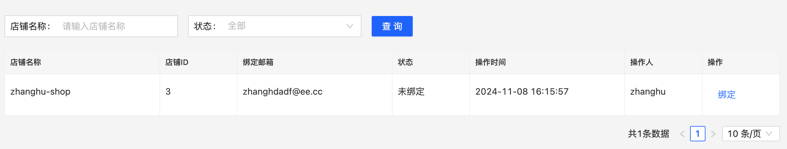
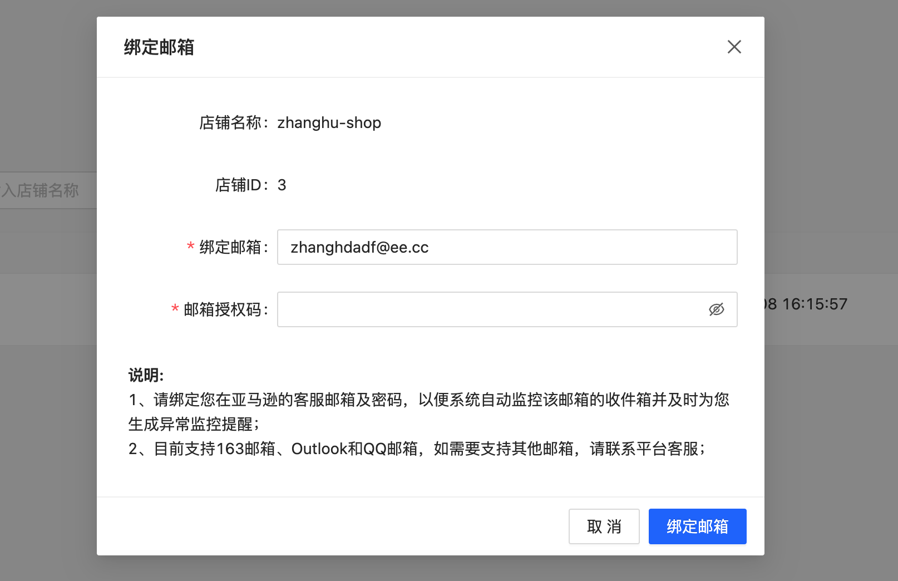

# 入门实例

## 核心流程
定义基础模型 -> 构建业务模型 -> 实例化数据模型 -> 构建UI -> 创建模型DataAction(数据请求) -> mock DataAction(可选)

## 1. 定义模型, 推荐单独的model文件
```js
import MD from 'md-base';

// 创建基础的店铺模型，这里是因为店铺的信息很多地方会使用，所以单独抽象
const BaseShop = MD.create({
  // 模型名称,必须
  name: 'BaseShop',
  // 模型标题，不会直接使用，用于模型的管理以及跟踪
  title: '商家店铺基础模型',
  // 模型字段
  fields: [
    {
      //字段名，必须
      name: 'shopId',
      //字段标题，必须，会在各类UI渲染中使用
      title: '店铺ID',
      // 数据类型，包括基础数据类型(string, number,date, object, array)和扩展类型（integer，dateTime, url……）
      dataType: 'integer',
      // 是否主键，一个模型有且至于一个主键，默认dataAction会使用
      isKey: true,
    },
    {
      name: 'platform',
      // 业务类型，除了内置的enum外，基本都为业务扩展
      bizType: 'platform',
    },
    {
      name: 'tenantId',
      title: '商家Id',
      dataType: 'integer',
    },
    {
      name: 'shopName',
      title: '店铺名称',
      dataType: 'string',
      // 必须
      required: true,
      // 最大长度
      max:20,
    },
    {
      name: 'region',
      title: '区域',
      dataType: 'string',
      required: true,
    },
    {
      name: 'sites',
      title: '站点',
      dataType: 'array',
      required: true,
      // 格式化配置，不同的dataType的format参数都有差异，数据为分隔符
      format: '、',
    },
  ],
});

// 创建店铺邮箱授权模型，继承之BaseShop，这次也为基础模型
const BaseShopMail = BaseShop.extend({
  name: 'ShopMail',
  title: '店铺邮箱',
  fields: [
    // 直接继承，使用字段名即可
    'shopId',
    'shopName',
    //继承并扩展
    {
      name: 'platform',
      // 设置数据存储的key
      key: 'platformType',
      dataType: 'integer',
    },
    'tenantId',
    // 新增的字段
    {
      name: 'mail',
      title: '绑定邮箱',
      key: 'mailAddress',
      // 使用邮箱的扩展类型
      dataType: 'mail',
      required: true,
    },
    {
      name: 'password',
      title: '邮箱授权码',
      // 使用密码的扩展类型
      dataType: 'password',
      required: true,
    },
    {
      name: 'status',
      title: '状态',
      key: 'bindStatus',
      dataType: 'integer',
      // 枚举类型
      bizType: 'enum',
      // 枚举的数据源
      source: [
        { label: '已绑定', value: 1 },
        { label: '未绑定', value: 0 },
        { label: '绑定失败', value: 2 },
      ],
    },
    {
      name: 'updatedTime',
      title: '操作时间',
      dataType: 'datetime',
    },
    {
      name: 'updatedBy',
      title: '操作人',
      dataType: 'string',
    },
  ],
});

// 创建列表场景的模型
const ShopMailList = BaseShopMail.extend({
  // 模型的类型，分为data和list两种，分别对应对象和数组
  modelType: 'list',
  name: 'ShopMailList',
  title: '店铺邮箱列表',
  // 开启列表项模型，列表项模型可以会继承父模型的配置，可以用于操作单条数据
  itemModel: true,
  // 过滤配置，会生成filterModel，可以用于列表查询和生成查询条件表单
  filter: {
    // 过滤的字段，同模型字段配置一直
    fields: ['shopName', 'status'],
  },
  // 行为配置（数据请求行为），内置了基于模型的query，update，insert，delete四个action，还可以定义其他的
  action: {
    // 查询配置，查询的参数来源于filter
    query: {
      // 地址
      url: '/csc-mail-service/seller/web/mail-conf/query-page-list',
      // 映射配置
      dataMapping: {
        // response的映射是数据转入模型
        response: {
          list: 'data.items',
          pageSize: 'data.pageSize',
          pageIndex: 'data.currentPage',
          total: 'data.total',
        },
      },
      // 查询项配置
      options: {
        // 请求类型
        type: 'get',
        // 查询默认参数
        data: {
          tenantId: 1,
          platformType: 2,
        },
      },
    },
    update: {
      url: '/csc-mail-service/seller/web/mail-conf/bind',
      // update的的字段
      fields: ['shopId', 'mail', 'password', 'tenantId', 'platform'],
    },
    delete: {
      url: '/csc-mail-service/seller/web/mail-conf/unbind',
      fields: ['shopId', 'mail', 'tenantId', 'platform'],
    },
  },
});
```

## 2. 构建页面jsx
```js
const ShopMailManager = () => {
  // 实例化模型
  const mList = ShopMailList.use();

  // 通过模型进行渲染，list模型渲染对应的MDTable组件，mList.render(mdTableProps)
  return mList.render({
        // 自动加载，开启后，会自动执行模型的query并进行数据绑定
        autoLoad: true,
        // 开启过滤，生产查询表单
        filter: true,
        // 编辑模式，popup代表使用弹窗进行编辑
        editMode: 'popup',
        // 列表项，除了field外，其他项都为Antd Table的column的设置
        columns: [
          { field: 'shopName', width: '20%' },
          { field: 'shopId', width: '10%' },
          { field: 'mail', width: '20%' },
          { field: 'status', width: '10%' },
          { field: 'updatedTime', width: '20%' },
          { field: 'updatedBy', width: '10%' },
        ],
        // 行操作, 内置了edit，view和delete行为逻辑
        rowOperations: {
          items: [
            {
              name: 'edit',
              title: '绑定',
              // 判断是否显示
              checkVisible({ item }) {
                return item.bindStatus !== 1;
              },
              // 行为事件，定义了会覆盖内置的逻辑
              // onClick(e, args) {
              //   const {item, model, scene} = args;
              // }
            },
            {
              name: 'delete',
              title: '解绑',
              // confirm设置
              confirm: {
                title: '您即将解绑邮箱，请确认?',
              },
              // 执行成功后的消息
              message: '解绑成功',
              checkVisible({ item }) {
                return item.bindStatus === 1;
              }
            },
          ],
        },
        // 弹窗编辑器属性
        editorProps: {
          title: '绑定邮箱',
          width: 600,
          // 编辑器操作项
          operations: {
            // 内置了save和cancel
            items: [
              'cancel',
              {
                name: 'save',
                title: '绑定邮箱',
                message: '邮箱绑定成功'
              },
            ],
          },
          // form的属性，对应MDForm
          formProps: {
            // 表单展示的字段
            fields: ['shopName', 'shopId', 'mail', 'password'],
            // 字段的ui属性设置
            fieldsProps: {
              shopName: {
                scene: 'view',
              },
              shopId: {
                scene: 'view',
              },
            },
            children() {
              return (
                <div className="gh-readme">
                  <div className="gh-readme-title">说明: </div>
                  <div>
                    1、请绑定您在亚马逊的客服邮箱及密码，以便系统自动监控该邮箱的收件箱并及时为您生成异常监控提醒；
                  </div>
                  <div>
                    2、目前支持163邮箱、Outlook和QQ邮箱，如需要支持其他邮箱，请联系平台客服；
                  </div>
                </div>
              );
            },
          },
        },
        // 查询表单属性
        searchProps: {
          operations: {
            items: [
              {
                name: 'search',
              },
            ],
          },
        },
      }
  );
};
```
## 最后效果
列表



编辑弹窗


